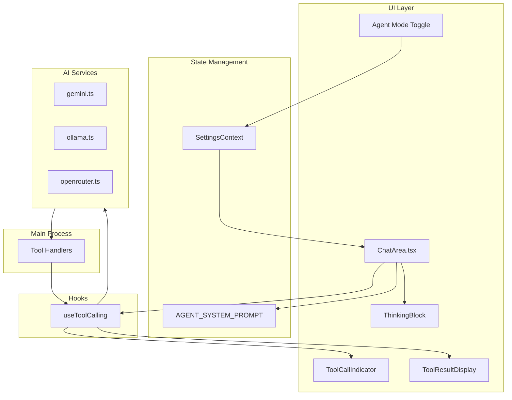

# Design Document: Agent Mode

## Overview

Agent Mode transforms Zura from a conversational AI assistant into an autonomous agent capable of executing multi-step tasks on the user's computer. This feature leverages the existing tool infrastructure (40+ tools including computer control, file operations, web search) and adds a specialized system prompt that instructs the AI to follow the ReAct (Reasoning + Acting) pattern.

The implementation focuses on:
1. A dedicated `AGENT_SYSTEM_PROMPT` that defines agent behavior
2. Automatic tool enablement when agent mode is active
3. Integration with existing `useToolCalling` hook for tool execution
4. Visual feedback through existing UI components (ThinkingBlock, ToolCallIndicator, ToolResultDisplay)

## Architecture



## Components and Interfaces

### 1. Agent System Prompt (New)

Location: `src/contexts/SettingsContext.tsx`

```typescript
export const AGENT_SYSTEM_PROMPT = `You are Zura, an autonomous AI agent...`
```

The prompt will define:
- Agent identity and capabilities
- ReAct pattern (Reasoning → Action → Observation → Repeat)
- Available tools and when to use them
- Safety guidelines and user confirmation requirements
- Iteration behavior until goal completion

### 2. Modified ChatArea Component

Location: `src/components/Dashboard/ChatArea.tsx`

Changes:
- Use `AGENT_SYSTEM_PROMPT` when `settings.agentModeEnabled` is true
- Override `toolsEnabled` to true when agent mode is active
- Handle agent loop (multiple tool calls in sequence)
- Display tool executions inline in chat messages

### 3. Agent Cursor Component (New)

Location: `src/components/AgentCursor.tsx`

A synthetic cursor that provides visual feedback when the agent is performing actions:

```typescript
interface AgentCursorProps {
    isActive: boolean
    currentAction?: string  // e.g., "Clicking", "Typing", "Searching"
    position?: { x: number; y: number }  // For screen actions
}
```

Features:
- Animated cursor icon that appears when agent mode is executing
- Shows current action label (e.g., "🔍 Searching...", "📁 Reading file...")
- For computer control actions (mouse/keyboard), shows position on screen
- Pulsing animation to indicate activity
- Different states: idle, thinking, executing, complete

### 4. Tool Execution Display in Chat (New)

Location: `src/components/AgentToolExecution.tsx`

A component that displays tool executions inline within chat messages:

```typescript
interface AgentToolExecutionProps {
    toolName: string
    args: Record<string, any>
    status: 'pending' | 'executing' | 'success' | 'error'
    result?: any
    error?: string
    duration?: number
}
```

Features:
- Collapsible card showing tool name and parameters
- Real-time status indicator (spinner while executing)
- Shows result or error after completion
- Execution duration display
- Syntax highlighting for code/JSON results

### 5. Existing Components (Enhanced)

- `useToolCalling` hook - Add callback for cursor position updates
- `ToolCallIndicator` - Already displays tool calls (will be used inside AgentToolExecution)
- `ToolResultDisplay` - Already shows tool results (will be used inside AgentToolExecution)
- `ThinkingBlock` - Already shows reasoning

## Data Models

### Settings Interface (Existing)

```typescript
interface Settings {
    // ... existing fields ...
    agentModeEnabled: boolean  // Already exists
    toolsEnabled: boolean      // Will be overridden when agent mode is on
    toolApprovalMode: 'always' | 'sensitive' | 'never'
}
```

### Tool Call Flow (Existing)

```typescript
interface ToolCall {
    id: string
    name: string
    arguments: Record<string, any>
}

interface ToolCallResult {
    toolCall: ToolCall
    result: any
    error?: string
}
```

## Correctness Properties

*A property is a characteristic or behavior that should hold true across all valid executions of a system-essentially, a formal statement about what the system should do. Properties serve as the bridge between human-readable specifications and machine-verifiable correctness guarantees.*

Based on the prework analysis, the following properties can be tested:

### Property 1: Agent mode enables agent system prompt
*For any* settings state where `agentModeEnabled` is true, the effective system prompt used in AI calls SHALL be the `AGENT_SYSTEM_PROMPT` constant.
**Validates: Requirements 1.1, 5.1**

### Property 2: Agent mode toggle is reversible
*For any* settings state, toggling `agentModeEnabled` on then off SHALL result in the standard system prompt being used (round-trip property).
**Validates: Requirements 1.2**

### Property 3: Agent mode overrides tool settings
*For any* settings state where `agentModeEnabled` is true, tools SHALL be available for use regardless of the `toolsEnabled` setting value.
**Validates: Requirements 1.4**

### Property 4: Tool results are incorporated into conversation
*For any* tool execution that returns a result, that result SHALL be formatted and included in the message history for the next AI call.
**Validates: Requirements 2.3, 3.2**

### Property 5: Tool errors are reported
*For any* tool execution that fails, the error message SHALL be included in the conversation for the AI to observe.
**Validates: Requirements 2.4**

### Property 6: Sequential tool execution preserves order
*For any* sequence of tool calls, each tool's result SHALL be processed before the next tool call is made.
**Validates: Requirements 3.4**

### Property 7: Sensitive tools require approval based on settings
*For any* tool with `requiresApproval: true`, when `toolApprovalMode` is 'sensitive' or 'always', the system SHALL request user confirmation before execution.
**Validates: Requirements 4.3**

### Property 8: Thinking content is parsed correctly
*For any* AI response containing thinking markers (e.g., `<think>`, `**Thinking...**`), the `parseThinkingContent` function SHALL extract the thinking portion separately from the answer.
**Validates: Requirements 6.1**

### Property 9: Tool executions are displayed in chat
*For any* tool call made during agent execution, the tool name, parameters, and result SHALL be displayed inline in the chat message.
**Validates: Requirements 3.1, 6.2, 6.3**

### Property 10: Agent cursor reflects current action
*For any* agent action (thinking, executing tool, complete), the agent cursor component SHALL display the corresponding state and action label.
**Validates: Requirements 6.2**

## UI Design

### Agent Cursor

The agent cursor is a floating indicator that shows when the agent is active:

```
┌─────────────────────────────────────┐
│  🤖 Agent Active                    │
│  ├─ 🔍 Searching web...            │
│  └─ ⏱️ 2.3s                         │
└─────────────────────────────────────┘
```

States:
- **Idle**: Hidden or subtle "Agent Ready" indicator
- **Thinking**: "🧠 Thinking..." with pulsing animation
- **Executing**: Tool icon + action name (e.g., "🔍 Searching...", "📁 Reading file...")
- **Complete**: "✅ Done" briefly, then fades

### Tool Execution Display in Chat

Tool executions appear inline within assistant messages:

```
┌─────────────────────────────────────────────────────────────┐
│ 🤖 Assistant                                                │
│                                                             │
│ I'll search for the latest news on that topic.              │
│                                                             │
│ ┌─────────────────────────────────────────────────────────┐ │
│ │ 🔍 web_search                              ✅ Success   │ │
│ │ ├─ query: "latest AI news December 2024"               │ │
│ │ ├─ num_results: 5                                      │ │
│ │ └─ ⏱️ 1.2s                                              │ │
│ │ ▼ Results                                              │ │
│ │   • OpenAI announces GPT-5...                          │ │
│ │   • Google releases Gemini 2.0...                      │ │
│ └─────────────────────────────────────────────────────────┘ │
│                                                             │
│ Based on the search results, here's what I found...         │
└─────────────────────────────────────────────────────────────┘
```

### CSS Styling

Location: `src/components/AgentCursor.css`, `src/components/AgentToolExecution.css`

Key styles:
- Glassmorphism effect for cursor (blur, transparency)
- Smooth animations for state transitions
- Color coding: blue for executing, green for success, red for error
- Collapsible sections for tool results

## Error Handling

1. **Tool Execution Failures**: When a tool fails, the error is captured and sent back to the AI as an observation, allowing it to try an alternative approach.

2. **AI Provider Errors**: Standard error handling from existing services applies. Errors are displayed to the user via toast notifications.

3. **User Cancellation**: When the user clicks stop, `isLoading` is set to false, halting any pending operations.

4. **Approval Rejection**: If a user rejects a tool approval request, the tool is skipped and the AI is informed.

## Testing Strategy

### Unit Tests
- Test `parseThinkingContent` function with various input formats
- Test prompt selection logic based on `agentModeEnabled`
- Test tool availability override when agent mode is active

### Property-Based Tests
Using a property-based testing library (e.g., fast-check), we will test:
- Property 1-8 as defined above
- Generate random settings combinations and verify invariants
- Generate random tool results and verify formatting

### Integration Tests
- Test full agent loop with mock AI responses
- Test tool execution flow end-to-end
- Test cancellation behavior

### Testing Framework
- **Unit/Integration**: Vitest (already configured in the project)
- **Property-Based Testing**: fast-check library
