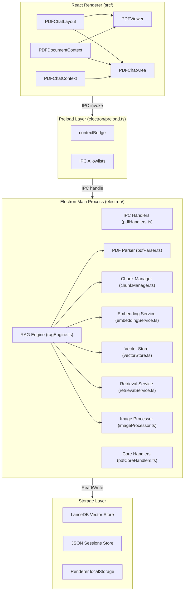
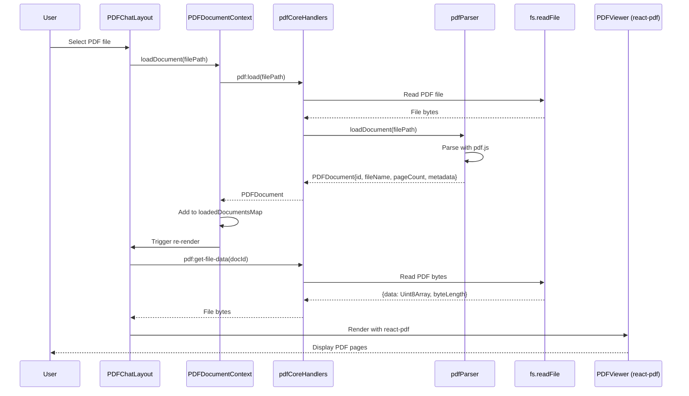
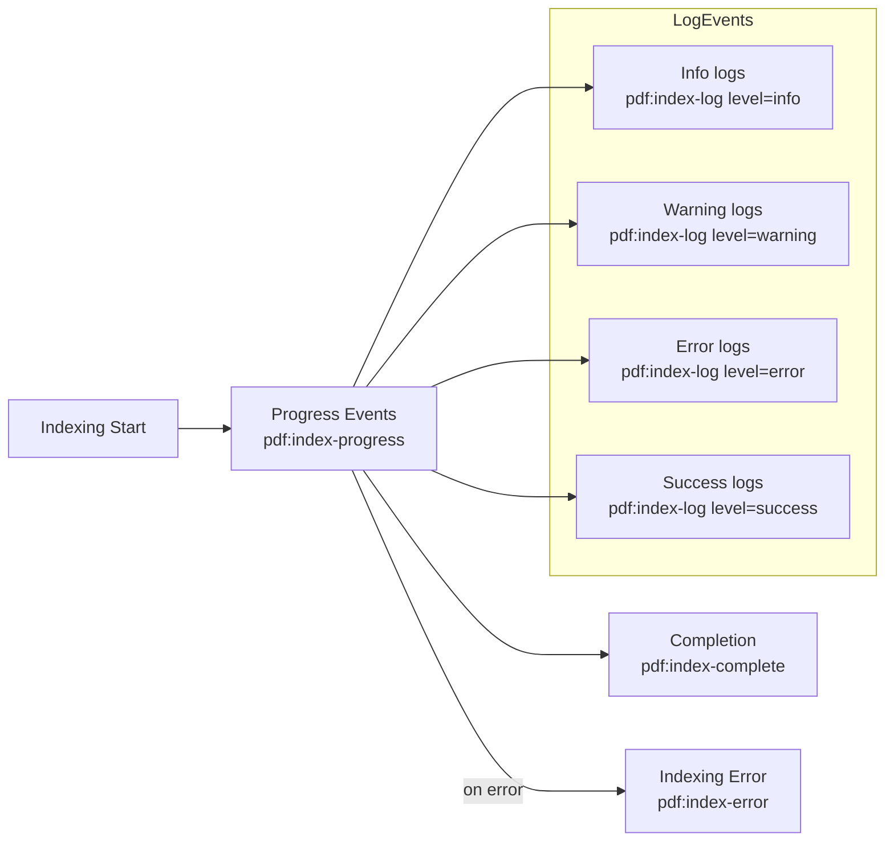
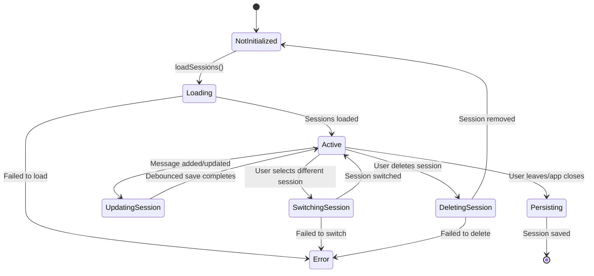
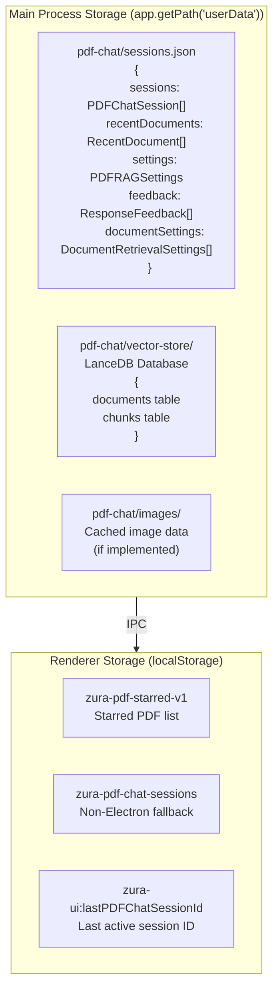
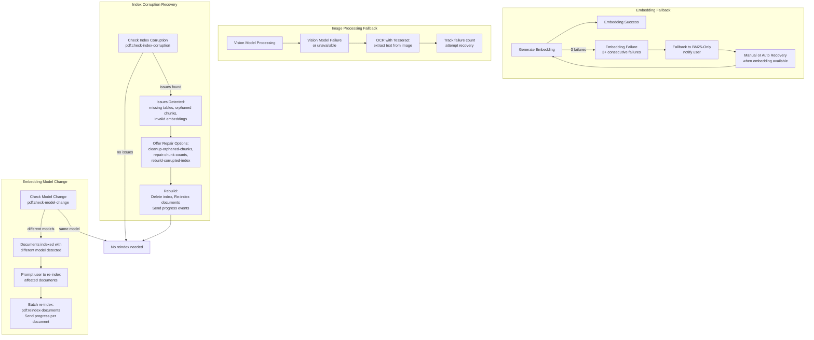

# PDF System Workflow Documentation

This document describes the complete architecture and workflows of the PDF Reader Chat system implemented in ZuraAI.

## Table of Contents

1. [Architecture Overview](#architecture-overview)
2. [Document Loading Flow](#document-loading-flow)
3. [Indexing Flow](#indexing-flow)
4. [Chat Query Flow](#chat-query-flow)
5. [Citation System](#citation-system)
6. [Session Management](#session-management)
7. [Storage Architecture](#storage-architecture)
8. [Error Handling & Fallbacks](#error-handling--fallbacks)

---

## Architecture Overview

The PDF system consists of four main layers:



### Component Hierarchy

```
PDFChatLayout (Main container)
├── DocumentTabs (Multi-document tabs)
│   └── Tab item for each loaded document
├── PDFViewer (Left panel - PDF rendering)
│   ├── PDFControls (Page navigation)
│   ├── PDFThumbnails (Sidebar thumbnails)
│   └── CitationHighlight (Overlay for citations)
└── PDFChatArea (Right panel - Chat interface)
    ├── IndexingPromptMessage (Inline indexing prompts)
    ├── PDFMessage (Message rendering)
    │   ├── CitationLink (Clickable citations)
    │   └── SourcesPanel (Expandable sources)
    ├── InputArea (Message input)
    └── ExportMenu (Copy/Download)
```

### IPC Channel Summary

| Category | Channel | Direction | Purpose |
|----------|----------|-----------|---------|
| **Core PDF** | `pdf:load` | R→M | Load PDF document |
| | `pdf:get-file-data` | R→M | Get PDF bytes for renderer |
| | `pdf:get-page` | R→M | Get specific page from loaded doc |
| | `pdf:search-text` | R→M | Search text within document |
| | `pdf:get-outline` | R→M | Get document outline/TOC |
| | `pdf:get-major-sections` | R→M | Extract major sections |
| | `pdf:unload` | R→M | Unload document from memory |
| **Indexing** | `pdf:index` | R→M | Index document for RAG |
| | `pdf:get-index-status` | R→M | Get indexing status |
| | `pdf:delete-index` | R→M | Delete document index |
| **Query** | `pdf:get-context` | R→M | Get RAG context for query |
| | `pdf:query` | R→M | Full RAG query (deprecated) |
| | `pdf:get-chunks` | R→M | Get chunks by ID |
| | `pdf:summarize-document` | R→M | Generate document summary |
| **Session** | `pdf-chat:create-session` | R→M | Create new chat session |
| | `pdf-chat:get-sessions` | R→M | Get all sessions |
| | `pdf-chat:get-session` | R→M | Get specific session |
| | `pdf-chat:save-session` | R→M | Save/update session |
| | `pdf-chat:delete-session` | R→M | Delete session |
| | `pdf-chat:get-recent-documents` | R→M | Get recent PDFs |
| **Settings** | `pdf:get-settings` | R→M | Get RAG settings |
| | `pdf:update-settings` | R→M | Update RAG settings |
| | `pdf:get-document-settings` | R→M | Get per-document settings |
| | `pdf:update-document-settings` | R→M | Update per-document settings |
| | `pdf:save-feedback` | R→M | Save feedback |
| | `pdf:get-feedback` | R→M | Get feedback |
| **Events** | `pdf:index-progress` | M→R | Indexing progress (0-100%) |
| | `pdf:index-complete` | M→R | Indexing completed |
| | `pdf:index-error` | M→R | Indexing error |
| | `pdf:index-log` | M→R | Detailed indexing logs |
| | `pdf:reindex-progress` | M→R | Re-indexing progress |
| | `pdf:model-download-progress` | M→R | Model download progress |
| | `pdf:model-download-complete` | M→R | Model download complete |
| | `pdf:embedding-fallback-status` | M→R | Fallback state change |
| | `pdf:rebuild-progress` | M→R | Index rebuild progress |

---

## Document Loading Flow

User selects a PDF file through the UI, which triggers the document loading and parsing process.



### Steps

1. **File Selection** (Renderer)
   - User selects PDF file through file dialog or drag-and-drop
   - `PDFChatLayout.loadDocument()` called with file path

2. **IPC Request** (Renderer → Main)
   - `window.ipcRenderer.invoke('pdf:load', filePath)`
   - Request includes optional password for encrypted PDFs

3. **File Reading** (Main Process)
   - `pdfParserService.loadDocument()` reads file from disk
   - Validates file path and file format

4. **PDF Parsing** (Main Process)
   - Uses pdf.js to parse document structure
   - Extracts:
     - Total page count
     - Document metadata (title, author, subject)
     - Text blocks with bounding boxes
     - Images with coordinates
     - Tables with coordinates
     - Outline/table of contents

5. **Document Storage** (Main Process)
   - Generates unique document ID: `doc_{sha256hash}`
   - Stores in memory: `pdfParser.loadedDocuments` Map
   - Returns `PDFDocument` object to renderer

6. **Renderer State Update** (Renderer)
   - `PDFDocumentContext.addDocument()` updates state
   - Document added to `loadedDocumentsMap`
   - Triggers re-render of tabs and viewer

7. **PDF Rendering** (Renderer)
   - `PDFViewer` requests bytes via `pdf:get-file-data`
   - Main process reads file and returns `Uint8Array`
   - `react-pdf` renders PDF pages to canvas
   - Thumbnails generated for sidebar navigation

### Key Files

| Component | File | Purpose |
|-----------|------|---------|
| IPC Handler | [electron/ipc/pdfCoreHandlers.ts](electron/ipc/pdfCoreHandlers.ts) | Handles `pdf:load` |
| Parser Service | [electron/pdf/pdfParser.ts](electron/pdf/pdfParser.ts) | PDF.js parsing logic |
| Renderer Context | [src/contexts/PDFDocumentContext.tsx](src/contexts/PDFDocumentContext.tsx) | Document state management |
| Viewer Component | [src/components/PDFChat/PDFViewer.tsx](src/components/PDFChat/PDFViewer.tsx) | react-pdf rendering |

---

## Indexing Flow

Documents are indexed to enable semantic search and retrieval through the RAG (Retrieval-Augmented Generation) system.

```mermaid
sequenceDiagram
    participant User as User
    participant UI as PDFChatArea
    participant DocCtx as PDFDocumentContext
    participant IPC as pdfHandlers
    participant RAG as RAGEngine
    participant ChunkMgr as ChunkManager
    participant Embed as EmbeddingService
    participant VectorDB as VectorStore (LanceDB)
    participant ImgProc as ImageProcessor
    participant Events as IPC Events

    User->>UI: Open unindexed document
    UI->>UI: Check indexing status (pdf:get-index-status)
    UI->>IPC: pdf:get-index-status(docId)
    IPC->>VectorDB: Check if indexed
    VectorDB-->>IPC: IndexStatus{isIndexed, chunkCount}
    IPC-->>UI: Not indexed
    UI->>UI: Show indexing prompt (IndexingPromptMessage)
    
    User->>UI: Confirm "Index this document"
    UI->>IPC: pdf:index(docId, options)
    IPC->>RAG: indexDocument(docId, options, onProgress, onLog)
    
    Note over RAG: Document Indexing Process
    
    RAG->>ChunkMgr: Check if document loaded
    RAG->>RAG: Initialize vector store
    
    loop For each page (1 to pageCount)
        RAG->>IPC: pdf:index-progress(docId, progress%)
        IPC->>Events: Send progress event
        Events->>UI: Update progress bar
        RAG->>RAG: Extract page text
        RAG->>ChunkMgr: createChunks(pageText, chunkingOptions)
        ChunkMgr->>ChunkMgr: Split into chunks (fixed/semantic/paragraph)
        ChunkMgr-->>RAG: Chunk[] {id, content, metadata}
        
        RAG->>Embed: generateEmbedding(chunk.content)
        Embed->>Embed: Call embedding model
        Note over Embed: Supports: Local/Ollama, OpenAI, Voyage
        Embed-->>RAG: vector[] (embedding)
        
        par Process page images (if enabled)
        RAG->>ImgProc: processImages(pageImages)
        ImgProc->>ImgProc: Extract with vision model
        Note over ImgProc: Vision model or OCR fallback
        ImgProc-->>RAG: Image descriptions
        RAG->>ChunkMgr: Create image chunks
        RAG->>Embed: generateEmbedding(imageDescription)
        Embed-->>RAG: image vectors
    end
    
    RAG->>VectorDB: addChunks(allChunkRecords)
    VectorDB->>VectorDB: Store in LanceDB tables
    VectorDB->>VectorDB: Create document record
    
    RAG->>IPC: pdf:index-progress(docId, 100)
    IPC->>Events: pdf:index-complete
    Events->>UI: Indexing complete
    RAG->>VectorDB: Update recent documents list
```

### Indexing Steps

#### 1. Validation Phase (0-10%)
- Check if document is already loaded in `pdfParser`
- Check if document exists in vector store
- Skip if already indexed and `forceReindex` is false

#### 2. Page Processing Loop (10-80%)

For each page in document:

a. **Text Extraction**
   - Extract text blocks with bounding boxes
   - Identify sections, paragraphs, headers
   - Handle empty pages gracefully

b. **Chunk Creation** ([chunkManager.ts](electron/pdf/chunkManager.ts))
   - **Fixed Size**: Split into chunks of N tokens with overlap
   - **Semantic**: Split at sentence/paragraph boundaries
   - **Paragraph**: Split at double newlines
   - Attach metadata: page numbers, bounding boxes, section headers
   - Calculate token count for each chunk

c. **Text Embedding** ([embeddingService.ts](electron/pdf/embeddingService.ts))
   - Truncate chunk content to max 500 chars (to avoid context overflow)
   - Generate vector embedding using configured model:
     - **Local**: Ollama (nomic-embed-text, gemma, mxbai, all-minilm)
     - **OpenAI**: `text-embedding-3-small`
     - **Voyage**: voyage-large-2 (not currently supported)
   - Handle embedding failures gracefully (log warning, continue)

d. **Image Processing** (if enabled) ([imageProcessor.ts](electron/pdf/imageProcessor.ts))
   - Extract images from page with bounding boxes
   - Process with vision model (e.g., qwen2-vl:2b)
   - Fallback to OCR (Tesseract) if vision unavailable
   - Create image chunks with format:
     ```
     [Figure]
     Caption: {caption}
     Description: {vision_model_description}
     Text in image: {ocr_text}
     ```
   - Generate embeddings for image descriptions

#### 3. Vector Storage (80-90%)

Add all chunk records to LanceDB ([vectorStore.ts](electron/pdf/vectorStore.ts)):

**Chunk Table Schema:**
```typescript
{
  id: string              // Chunk unique ID
  documentId: string     // Parent document ID
  content: string         // Text/image description
  pageNumbers: number[]   // Pages chunk spans
  boundingBoxes: string    // JSON of BoundingBox[]
  sectionHeader: string    // Section title if in section
  chunkIndex: number      // Position in document
  tokenCount: number       // Estimated tokens
  blockType: 'text' | 'table' | 'figure'
  vector: float[]          // Embedding vector
}
```

**Document Table Schema:**
```typescript
{
  id: string              // Document ID
  filePath: string         // File system path
  fileName: string         // Display name
  fileHash: string         // SHA-256 hash
  pageCount: number         // Total pages
  title?: string          // Metadata title
  author?: string         // Metadata author
  chunkCount: number      // Number of chunks indexed
  embeddingModel: string  // Model used for embeddings
  indexedAt: number        // Timestamp
}
```

#### 4. Completion (90-100%)

- Send `pdf:index-complete` event with:
  - `success`: boolean
  - `documentId`: string
  - `chunkCount`: number
  - `indexingTimeMs`: number
- Update `recentDocuments` list with `isIndexed: true`
- Persist to `pdf-chat/sessions.json`

### Indexing Options

| Option | Type | Default | Description |
|--------|------|----------|-------------|
| `chunkSize` | number | 512 | Max tokens per chunk |
| `chunkOverlap` | number | 128 | Token overlap between chunks |
| `chunkingStrategy` | 'fixed' \| 'semantic' \| 'paragraph' | 'semantic' | How to split text |
| `embeddingModel` | 'local' \| 'openai' \| 'voyage' | 'local' | Embedding model type |
| `localEmbeddingModel` | string | 'nomic-embed-text' | Specific Ollama model |
| `processImages` | boolean | true | Enable image processing |
| `forceReindex` | boolean | false | Force re-index even if indexed |
| `onProgress` | function | - | Progress callback (0-100) |
| `onLog` | function | - | Log callback (info/success/warning/error) |

### Event Flow During Indexing



---

## Chat Query Flow

Users interact with documents through natural language queries, which trigger the RAG retrieval and AI response generation.

```mermaid
sequenceDiagram
    participant User as User
    participant UI as PDFChatArea
    participant ChatCtx as PDFChatContext
    participant DocCtx as PDFDocumentContext
    participant IPC as pdfHandlers
    participant RAG as RAGEngine
    participant Retrieval as RetrievalService
    participant VectorDB as VectorStore
    participant AI as AI Provider
    participant Feedback as Feedback System

    User->>UI: Enter query "What is the main conclusion?"
    UI->>UI: Check if document indexed
    UI->>IPC: pdf:get-index-status(docId)
    IPC-->>UI: IndexStatus{isIndexed: true}
    
    UI->>ChatCtx: addMessage({role: 'user', content: query})
    ChatCtx->>UI: Display user message
    ChatCtx->>ChatCtx: Auto-save session (debounced)
    
    UI->>IPC: pdf:get-context(query, docIds, options, conversationContext)
    
    Note over RAG: Context Retrieval Process
    
    RAG->>RAG: rewriteQuery(query, conversationContext)
    Note over RAG: Query Rewrite
    RAG->>RAG: Detect view references ("this page", "current page")
    RAG->>RAG: Resolve pronouns ("it", "this")
    RAG->>RAG: Expand with conversation history
    
    par Hybrid Search
    RAG->>Retrieval: retrieveWithConfidence(query, docIds, options)
    Retrieval->>VectorDB: Vector similarity search (embedding)
    Retrieval->>Retrieval: BM25 keyword search
    Retrieval->>Retrieval: Combine scores (weighted average)
    Retrieval->>Retrieval: Rerank if enabled
    end
    
    Retrieval-->>RAG: RetrievalResult[] {chunk, score}
    
    RAG->>RAG: buildContext(results, options)
    Note over RAG: Context Building
    RAG->>RAG: Sort by score
    RAG->>RAG: Select top-K results
    RAG->>RAG: Format with citation markers: [[cite:chunkId:p5]]
    RAG->>RAG: Add page info, document name
    RAG->>RAG: Truncate to fit token limit (4000 tokens)
    
    RAG-->>IPC: {
        contextString: string,
        sources: RetrievalResult[],
        confidence: number,
        isLowConfidence: boolean,
        warning?: string,
        documentNameMap: Map<docId, docName>,
        pdfSystemPrompt: string
    }
    
    IPC-->>UI: RAG context
    
    UI->>AI: Generate completion with system prompt
    Note over AI: AI Generation
    UI->>UI: Build messages array:
        [
            {role: 'system', content: pdfSystemPrompt + retrievedContext},
            {role: 'user', content: originalQuery},
            ...conversationHistory
        ]
    AI->>AI: Call AI provider (OpenRouter/Groq/Gemini/etc.)
    AI-->>UI: Stream response text
    
    UI->>UI: Parse citations from response
    UI->>UI: Match pattern: \[\[cite:([a-zA-Z0-9_-]+):p(\d+)\]\]
    UI->>UI: Replace with numbered refs: [1], [2], [3]
    
    UI->>ChatCtx: addMessage({
        role: 'assistant',
        content: cleanText,
        citations: [{id, chunkId, pageNumber, documentName, quotedText}],
        sources: [...]
    })
    
    UI->>User: Display message with clickable citations
    
    User->>UI: Click citation [1]
    UI->>DocCtx: Navigate to page
    DocCtx->>DocCtx: setCurrentPage(citation.pageNumber)
    UI->>UI: Highlight bounding boxes
    
    User->>UI: Provide feedback
    UI->>Feedback: Save feedback (thumbs up/down, wrong citation, etc.)
```

### Query Processing Steps

#### 1. Query Rewrite ([ragEngine.ts:269](electron/pdf/ragEngine.ts#269))

The original query is enhanced using conversation context:

**View Reference Resolution:**
- Detect patterns: "this page", "current page", "the table above"
- Replace with: `page {currentPage}`
- Apply `pageFilter` to retrieval options

**Pronoun Resolution:**
- Detect pronouns: "it", "this", "that", "they"
- Extract key terms from conversation history
- Append context: "{query} (context: {keyTerms})"

**Conversation Expansion:**
- Detect follow-up indicators: "and", "also", "what about"
- Extract terms from previous 3 user messages
- Expand query: "{query} {previousTerms}"

**Overview Query Detection:**
- Patterns: "summarize", "what is this about", "give overview"
- Special handling: prioritize pages 1-5, lower score threshold (0.2), increase top-K (10)

#### 2. Hybrid Retrieval ([retrievalService.ts](electron/pdf/retrievalService.ts))

Two retrieval methods combined with configurable weight:

**Vector Similarity Search:**
- Generate query embedding using same model as chunks
- Cosine similarity search in LanceDB
- Returns: `{chunk, score: 0.0-1.0}`

**BM25 Keyword Search:**
- Tokenize query
- Calculate BM25 scores across chunks
- Returns: `{chunk, score: 0.0-1.0}`

**Score Fusion:**
```typescript
hybridScore = (alpha * vectorScore) + ((1 - alpha) * bm25Score)
```
- Default `alpha`: 0.7 (70% vector, 30% keyword)

**Reranking (Optional):**
- Re-rank top results using cross-encoder or similar
- Improves precision for top results

#### 3. Context Building ([ragEngine.ts:1069](electron/pdf/ragEngine.ts#1069))

Format retrieved chunks for AI prompt:

**Citation Marker Format:**
```
[[cite:{chunkId}:p{pageNumber}]]
```

**Markdown Format:**
```markdown
**Source 1** (Page 5 - Introduction) [[cite:chunk_abc123:p5]]
Content from the chunk...

**Source 2** (Page 7 - Methods) [[cite:chunk_def456:p7]]
More content...
```

**Truncation:**
- Sort by relevance score (descending)
- Add chunks until `maxTokens` (4000) reached
- Try to fit partial chunk if near limit (≥50 tokens)

#### 4. AI Response Generation

**System Prompt Construction:**
```typescript
pdfSystemPrompt = generatePDFSystemPrompt({
    documentNames: [...],
    pageCount: total,
    currentPage: currentViewPage,
    hasMultipleDocuments: docIds.length > 1,
    retrievedContext: contextString,
    groundedMode: options.minScore > 0.5
})
```

System prompt instructions:
- Use only the provided context
- Include citations in format `[[cite:chunkId:p5]]`
- Be precise and factual
- In grounded mode, refuse to answer if no relevant context

**Streaming Response:**
- Send request to AI provider (OpenRouter, Groq, Gemini, etc.)
- Stream text chunks as they arrive
- Parse citations in real-time using regex: `/\[\[cite:([a-zA-Z0-9_-]+):p(\d+)\]\]/g`
- Replace citation markers with numbered references `[1]`, `[2]`, etc.

### Query Options

| Option | Type | Default | Description |
|--------|------|----------|-------------|
| `topK` | number | 5 | Max chunks to retrieve |
| `minScore` | number | 0.5 | Minimum confidence threshold |
| `useHybrid` | boolean | true | Enable hybrid vector+BM25 |
| `hybridAlpha` | number | 0.7 | Vector search weight (0-1) |
| `useReranker` | boolean | true | Enable result reranking |
| `maxSourcesInContext` | number | 8 | Max sources in AI prompt |
| `pageFilter` | {start, end} | - | Restrict to page range |
| `sectionFilter` | string | - | Restrict to section title |

---

## Citation System

Citations provide traceability from AI responses back to specific locations in the source documents.

```mermaid
graph TB
    subgraph AIResponse["AI Response Text"]
        AIPart["The study reveals that neural networks<br/>achieve higher accuracy when<br/>trained with diverse datasets [[cite:chunk_abc:p12]].<br/>This is confirmed by [[cite:chunk_def:p15]] which<br/>shows 95% accuracy."]
    end

    subgraph CitationParsing["Citation Parsing"]
        Pattern[Regex Pattern: /\[\[cite:([a-zA-Z0-9_-]+):p(\d+)\]\]/]
        Replacement[Replace with [1], [2], [3]]
        Map[Map chunkId to chunk info]
    end

    subgraph CitationDisplay["Citation Display"]
        Link[Clickable Link: [1] Document, p.12]
        Highlight[Bounding Box Highlight on PDF]
        SourcesPanel[Sources Panel with Details]
    end

    subgraph CitationActions["Citation Actions"]
        Click[Click to navigate to page]
        Feedback[Thumbs up/down, Wrong citation feedback]
    end

    AIResponse --> CitationParsing
    CitationParsing --> CitationDisplay
    CitationDisplay --> CitationActions
    
    Map --> SourcesPanel
```

### Citation Format

**In AI Response (Internal):**
```
[[cite:{chunk_id}:p{page_number}]]
```

**Displayed to User:**
```
[1] Document Name, p.12
```

**Parsed Data Structure:**
```typescript
interface Citation {
    id: string;                  // "citation-0", "citation-1"
    chunkId: string;             // Original chunk ID
    documentName: string;          // Document file name
    pageNumber: number;           // Page number
    quotedText: string;           // First 150 chars of chunk
    boundingBoxes: BoundingBox[]; // Highlight regions
}
```

### Citation Types

1. **Text Citations**: Standard text chunks
2. **Image Citations**: Figures/charts with descriptions
3. **Table Citations**: Tabular data

### Citation Interaction Flow

```mermaid
sequenceDiagram
    participant User as User
    participant UI as PDFMessage
    participant Link as CitationLink
    participant PDF as PDFViewer
    participant DocCtx as PDFDocumentContext
    participant Highlight as CitationHighlight

    User->>UI: See response with citation [1]
    UI->>Link: Render clickable link [1] Document, p.12
    User->>Link: Click citation [1]
    Link->>DocCtx: Navigate to page (citation.pageNumber)
    DocCtx->>PDF: Set current page
    PDF->>Highlight: Show bounding boxes (citation.boundingBoxes)
    PDF-->>User: Highlighted region on PDF
    
    User->>UI: Provide feedback
    UI->>UI: Save feedback (thumbs up/down, wrong citation)
    UI->>IPC: pdf:save-feedback(feedback)
    IPC->>IPC: Store in sessions.json
```

### Feedback Types

| Type | Purpose |
|------|---------|
| `thumbs_up` | Response was helpful |
| `thumbs_down` | Response was not helpful |
| `wrong_citation` | Citation points to wrong location |
| `missing_citation` | Missing citation for claim |
| `inaccurate_quote` | Quoted text is inaccurate |

---

## Session Management

Sessions allow users to maintain conversation state across multiple documents.

```mermaid
graph TB
    subgraph SessionData["Session Data Structure"]
        Session[PDFChatSession<br/>{
            id: string
            title: string
            documentIds: string[]
            messages: PDFChatMessage[]
            createdAt: number
            updatedAt: number
        }]
        Message[PDFChatMessage<br/>{
            id: string
            role: 'user' | 'assistant'
            content: string
            citations?: Citation[]
            sources?: RetrievalResult[]
            timestamp: number
        }]
    end

    subgraph SessionCRUD["Session CRUD Operations"]
        Create[pdf-chat:create-session<br/>Creates session with document IDs]
        Read[pdf-chat:get-sessions<br/>Returns all sessions]
        ReadOne[pdf-chat:get-session<br/>Returns specific session]
        Update[pdf-chat:save-session<br/>Saves/updates session]
        Delete[pdf-chat:delete-session<br/>Deletes session]
    end

    subgraph SessionPersistence["Persistence"]
        MainProcess[Main Process Storage<br/>pdf-chat/sessions.json]
        RendererLocal[Renderer localStorage<br/>zura-pdf-chat-sessions<br/>Fallback for non-Electron]
        LastActive[Last Active Session<br/>zura-ui:lastPDFChatSessionId]
    end

    subgraph AutoSave["Auto-Save Mechanism"]
        Debounce[Debounce 750ms<br/>Avoid excessive IPC calls]
        Triggers[On message added/updated<br/>On session switched]
    end

    SessionData --> SessionCRUD
    SessionCRUD --> SessionPersistence
    SessionPersistence --> AutoSave
```

### Session Lifecycle



### Session Features

1. **Multi-Document Sessions**
   - One session can reference multiple PDF documents
   - Enables cross-document Q&A
   - RAG searches across all linked documents

2. **Auto-Generated Titles**
   - New sessions start with document name
   - First user message updates title to summary of query
   - User can manually rename

3. **Conversation History**
   - Maintains full message history
   - Includes all citations and sources
   - Enables context-aware follow-up queries

4. **Recent Documents**
   - Tracks last 20 opened PDFs
   - Shows indexing status per document
   - Quick access from sidebar

---

## Storage Architecture

The PDF system uses a three-tier storage strategy for optimal performance and data integrity.



### Main Process Storage

**Location:** `app.getPath('userData')/pdf-chat/`

#### JSON Store ([sessions.json](electron/ipc/pdfHandlers.ts#131))

```typescript
interface PDFChatStoreData {
  sessions: PDFChatSession[];
  recentDocuments: RecentDocument[];
  settings: PDFRAGSettings;
  feedback: Array<ResponseFeedback | CitationFeedback>;
  documentSettings: DocumentRetrievalSettings[];
}
```

**Recent Document Schema:**
```typescript
interface RecentDocument {
  id: string;              // Document ID
  filePath: string;         // File system path
  fileName: string;         // Display name
  lastOpenedAt: number;     // Timestamp
  isIndexed: boolean;       // Has vector index?
  pageCount: number;         // Total pages
}
```

#### Vector Store ([vectorStore.ts](electron/pdf/vectorStore.ts))

**Technology:** LanceDB (embedded vector database)

**Location:** `pdf-chat/vector-store/`

**Tables:**

1. **Documents Table**
   - Primary key: `id`
   - Indexes: `fileName`, `embeddingModel`, `indexedAt`
   - Columns: id, filePath, fileName, fileHash, pageCount, title, author, chunkCount, embeddingModel, indexedAt

2. **Chunks Table**
   - Primary key: `id`
   - Indexes: `documentId`, `pageNumbers` (vector index for search)
   - Columns: id, documentId, content, pageNumbers, boundingBoxes, sectionHeader, chunkIndex, tokenCount, blockType, vector

**Vector Index:**
- 768-dimensional float vectors (for nomic-embed-text)
- HNSW index for fast approximate nearest neighbor search
- Supports hybrid vector + BM25 search

### Renderer Storage (localStorage)

**Keys:**

| Key | Type | Purpose |
|-----|------|---------|
| `zura-pdf-starred-v1` | Array<{filePath, fileName, starredAt}> | Starred PDF list |
| `zura-pdf-chat-sessions` | PDFChatSession[] | Non-Electron fallback |
| `zura-ui:lastPDFChatSessionId` | string | Restore last active session |

### Storage Synchronization

```mermaid
sequenceDiagram
    participant UI as PDFChatContext
    participant IPC as IPC
    participant Main as pdfHandlers
    participant JSON as JSON Store
    participant Vector as VectorStore

    Note over UI, IPC: Session Persistence
    UI->>IPC: pdf-chat:save-session(session)
    IPC->>Main: Update in-memory map
    Main->>JSON: Write sessions.json (debounced 750ms)
    Main->>UI: Success confirmation
    
    Note over UI, IPC: Session Retrieval
    UI->>IPC: pdf-chat:get-sessions()
    IPC->>Main: Load from in-memory map
    Main-->>UI: sessions[] array
    
    Note over IPC, Main, Vector: Document Indexing
    IPC->>IPC: pdf:index(docId, options)
    IPC->>Vector: addChunks(chunkRecords)
    Vector->>Vector: Store in LanceDB
    Vector->>Vector: Update document record
    Vector->>JSON: Update recentDocuments
    Main-->>IPC: IndexResult
```

---

## Error Handling & Fallbacks

The system includes multiple fallback mechanisms to handle errors gracefully.



### Embedding Fallback

**Trigger:** 3 consecutive embedding failures

**Fallback State:**
```typescript
interface EmbeddingFallbackState {
  isActive: boolean;      // Fallback mode active
  failureCount: number;   // Consecutive failures
  canRecover: boolean;    // Can attempt recovery
  lastError?: string;     // Last error message
}
```

**User Notification:**
```
⚠️ Embeddings are currently unavailable. Falling back to keyword-only search. 
   Some results may be less accurate.
[Attempt Recovery] [Dismiss]
```

**Recovery:** User clicks "Attempt Recovery" or automatic retry after timeout

### Image Processing Fallback

**Priority:**
1. Vision model (e.g., qwen2-vl:2b via Ollama)
2. OCR fallback (Tesseract) if vision fails

**Failure Tracking:**
```typescript
interface ImageFallbackState {
  isActive: boolean;
  failureCount: number;
  canRecover: boolean;
  preferredMethod: 'vision' | 'ocr';
}
```

### Index Corruption Detection & Repair

**Checks Performed:**
- Verify documents table exists
- Verify chunks table exists
- Check for orphaned chunks (no matching document)
- Validate embedding dimensions
- Check chunk count matches document record

**Repair Operations:**

| Operation | Description |
|-----------|-------------|
| `cleanup-orphaned-chunks` | Delete chunks without matching document |
| `repair-chunk-counts` | Update document chunkCount from actual chunks |
| `rebuild-corrupted-index` | Full rebuild of affected documents |
| `check-index-corruption` | Comprehensive integrity check |

**Rebuild Process:**
1. Phase 1: Preparing (0%)
2. Phase 2: Cleaning (5%) - Optional
3. Phase 3: Re-indexing (10-90%) - Per document
4. Phase 4: Verifying (95%)
5. Phase 5: Complete (100%)

---

## Key Configuration Files

| File | Purpose |
|------|---------|
| [electron/ipc/pdfCoreHandlers.ts](electron/ipc/pdfCoreHandlers.ts) | Core PDF IPC handlers (load, get-page, etc.) |
| [electron/ipc/pdfHandlers.ts](electron/ipc/pdfHandlers.ts) | Full RAG IPC handlers (index, query, sessions) |
| [electron/pdf/ragEngine.ts](electron/pdf/ragEngine.ts) | RAG orchestration and query processing |
| [electron/pdf/pdfParser.ts](electron/pdf/pdfParser.ts) | PDF.js-based parsing |
| [electron/pdf/chunkManager.ts](electron/pdf/chunkManager.ts) | Text chunking strategies |
| [electron/pdf/embeddingService.ts](electron/pdf/embeddingService.ts) | Embedding generation (local/OpenAI/Voyage) |
| [electron/pdf/vectorStore.ts](electron/pdf/vectorStore.ts) | LanceDB vector operations |
| [electron/pdf/retrievalService.ts](electron/pdf/retrievalService.ts) | Hybrid vector+BM25 retrieval |
| [electron/pdf/imageProcessor.ts](electron/pdf/imageProcessor.ts) | Vision model + OCR image processing |
| [src/contexts/PDFChatContext.tsx](src/contexts/PDFChatContext.tsx) | Session state management |
| [src/contexts/PDFDocumentContext.tsx](src/contexts/PDFDocumentContext.tsx) | Document state management |
| [src/components/PDFChat/PDFChatLayout.tsx](src/components/PDFChat/PDFChatLayout.tsx) | Main PDF chat layout |
| [src/components/PDFChat/PDFChatArea.tsx](src/components/PDFChat/PDFChatArea.tsx) | Chat interface with citations |
| [src/types/pdf.ts](src/types/pdf.ts) | All TypeScript type definitions |

---

## Performance Optimizations

1. **Chunking**
   - Semantic chunking preserves sentence boundaries
   - Configurable overlap (default 128 tokens)
   - Per-document override support

2. **Retrieval**
   - Hybrid search balances semantic and keyword matching
   - Reranking improves precision
   - Page/section filters reduce search space

3. **Caching**
   - Model availability cache (avoids repeated API calls)
   - Embedding service singleton
   - Vector store connection pooling

4. **Debouncing**
   - Session saves: 750ms debounce
   - Prevents excessive IPC calls during streaming

5. **Lazy Loading**
   - Image processor lazy-loaded (not imported until needed)
   - Tesseract loaded only if OCR fallback needed

---

## Summary

The PDF system provides a comprehensive RAG-powered document intelligence solution with:

- **Multi-document support**: Tab-based interface with cross-document queries
- **Semantic search**: Vector embeddings + hybrid BM25 retrieval
- **Precise citations**: Clickable links to exact PDF locations
- **Robust indexing**: Background processing with progress tracking
- **Image intelligence**: Vision model OCR with fallback
- **Session persistence**: Conversation history across app restarts
- **Error resilience**: Multiple fallback mechanisms (embedding, OCR, corruption recovery)
- **Flexible configuration**: Per-document settings, multiple embedding models

All data flows through a secure IPC boundary, with main process handling privileged operations (file I/O, vector database) and renderer handling UI and AI interactions.
